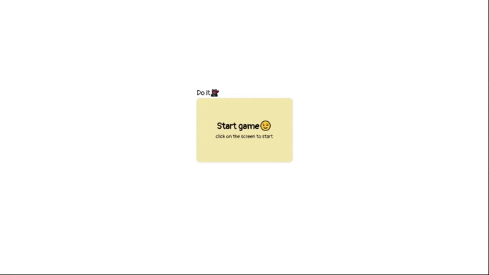
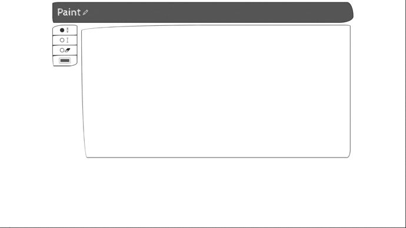
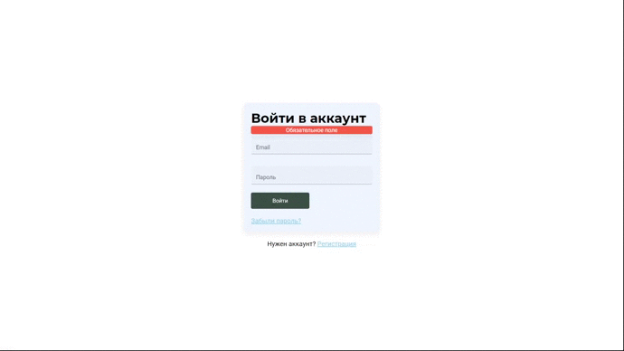
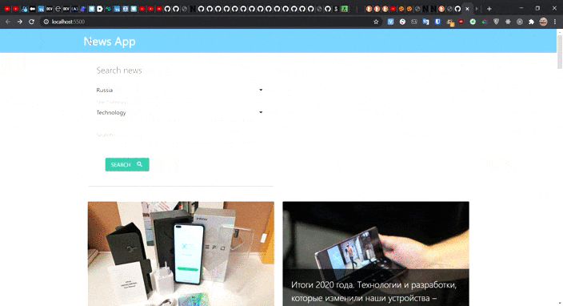
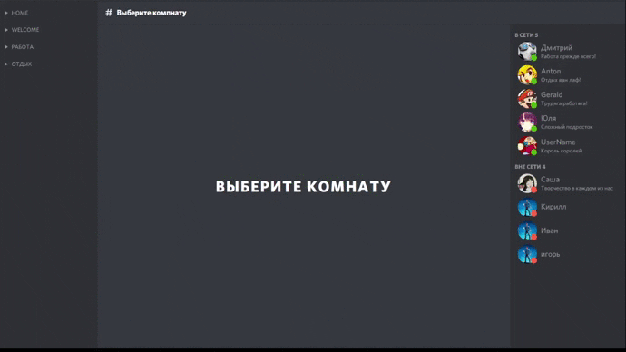

### Hello world 👋

## I'm a FrontEnd Developer 👨‍💻

- 💪 I like to write code
- 🎮 I love Nintendo games
- 📚 I am constantly learning new things

### Languages and Tools:

 
 

Progects 👨‍🏭

<blockquote> 

MemoryGame on Next.js

</blockquote>

<blockquote> 

Photoshop(mini) on JS

</blockquote>

<blockquote> 

ReactTodo + Firebase

</blockquote>

<blockquote> 

ToDo on JS

</blockquote>

<blockquote> 

NewsApp on JS

<!--  -->

</blockquote>

<blockquote> 

Discord on React

</blockquote>

 

### Connect with me:

[][telegram]
[][mail]
[][twitter]

 

  
:zap: Statistics:

   
     
    

[twitter]: https://twitter.com/gre4ka16
[telegram]: https://t.me/BigOrlando
[mail]: mailto:gre4kaDISCOUNT@gmail.com
